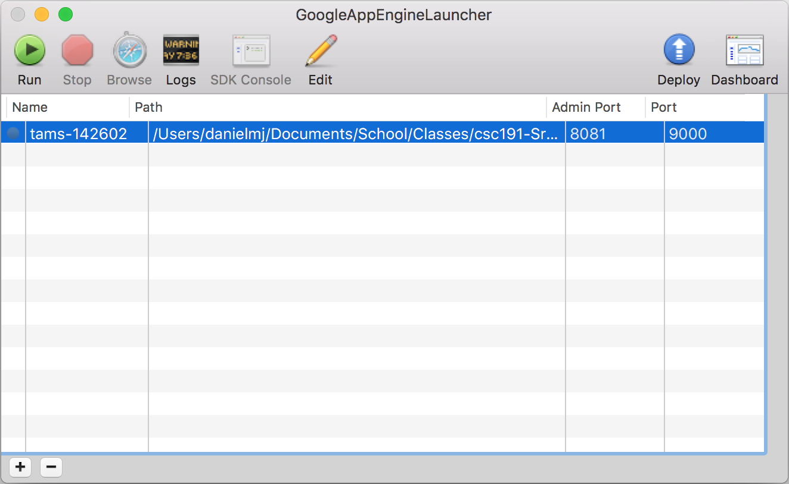

# Installation

1. Download & install the appenginelauncher from [Google App Engine SDK for PHP](https://cloud.google.com/appengine/downloads). (the launcher handles python too)
2. Open the GoogleAppEngineLauncher and click File > Open Existing Application.
3. Navigate to the project directory and choose

The launcher should look something like this:



# Updating/Add Python Libs

To add/remove python libs, modify the `/requirements-vendor.txt` file.

Then in terminal navigate to the folder with the requirements file and enter the following:
```
pip install -r requirements-vendor.txt -t ./lib
```

This will install the pip requirements to the lib folder. Be sure to add the new libs in the git repository.

# Running Locally

1. Click the run button on the project
2. Click the project then click the browse button
3. If this is the first time you are running the project, navigate to `/api/init/` to initialize the Site and the Admin account.

Check out the logs for any issues

## Using Terminal

You will need to follow a different instruction guide. Please use the following tutorial:

https://cloud.google.com/appengine/docs/python/cloud-sql/django

# Deploying

NOTE: You must have permission to deploy by the Google account administrator.

1. Click the project
2. Click deploy

Check out the logs for any issues
