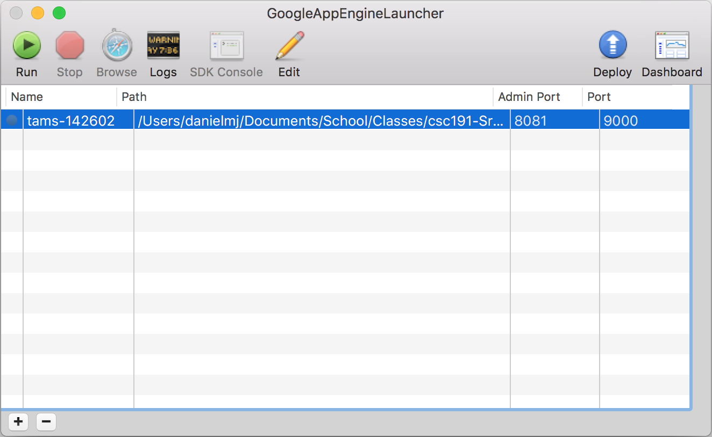

# Installation

1. Visit the following: [Google App Engine SDK](https://cloud.google.com/appengine/downloads)
2. Click Python
3. Click "Optionally, you can also download the original App Engine SDK for Python."
4. Then click the download button.
5. If you are on a Mac, you should get a nice GUI to manage the project
6. If you are not on a Mac, you may need to use the command line interface in order to do perform the same functions.

Because the primary development platform has been a Mac, the rest of the intallation instructions assumes the developer is using a Mac.

The launcher should look something like this:



# Updating/Add Python Libs

To add/remove python libs, modify the `/requirements-vendor.txt` file.

Then in terminal navigate to the folder with the requirements file and enter the following:
```
pip install -r requirements-vendor.txt -t ./lib
```

This will install the pip requirements to the lib folder. Be sure to add the new libs in the git repository.

# Running Locally

1. Click the run button on the project
2. Click the project then click the browse button
3. If this is the first time you are running the project, navigate to `/api/init/` to initialize the Site and the Admin account.

Check out the logs for any issues

## Using Terminal

You will need to follow a different instruction guide. Please use the following tutorial:

https://cloud.google.com/appengine/docs/python/cloud-sql/django

# Deploying

NOTE: You must have permission to deploy by the Google account administrator.

1. Click the project
2. Click deploy

Check out the logs for any issues

# Collect Static

Many Django websites use static files that are specific to individual applications. It is usually important to `collectstatic` to collect them all into a visible static directory. This way people can actually see the images when they are deployed.

In order to `collectstatic`, you will need to install all of the python requirements locally on your machine. The requirements for the application can be found in `requirements-vendor.txt`. You will also need to install the App Engine SDK. A quick not about that:

> NOTE: [source](https://cloud.google.com/appengine/docs/python/cloud-sql/django) Before running the following `manage.py` commands, you'll need to ensure that all of the necessary libraries are available for import by adding them to your `PYTHONPATH`. For example, if you downloaded the App Engine SDK to your home directory in `/home/user/google_appengine`, the following command could be used to ensure that the django and google packages would be found when running `manage.py`

PIP should automatically add the installed libraries to your `PYTHONPATH`.

To `collectstatic`, run the following command in terminal:

```
python manage.py collectstatic
```
